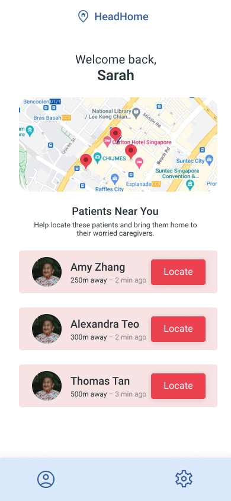

<div align="center">
    <div >
        
    </div>
    <div >
            <p style="font-size:50px;"><b>HeadHome</b></p>
            <p style="font-size:18px"><i>Your companion, every step of the way</i></p>
    </div>      
</div>
<br>

<h1 align="center">HeadHome Application</h1>
<div align="center">

| Patient | Caregiver | Volunteer |
|:---------:|:-----------:|:-----------:|
||||

</div>
The <b>HeadHome application</b> present users with a simplified and streamlined interface that highlights only the most relevant information for each user. The application's user interface and functionality will also be tailored to each user type (Dementia Patient, Caregivers and Volunteers). 
<br>
<h2>👨🏻‍💻 Technology Stack</h2>
<br />
<div align="center">
    <kbd>
        
    </kbd>
    <kbd>
        
    </kbd>
    <kbd>
        
    </kbd>
    <kbd>
        
    </kbd>
    <kbd>
        
    </kbd>	
    <h4>Flutter | Dart | Google Maps Platform | Firebase | Google Cloud Platform</h4>
</div>

<br>

# Getting Started
This repo contains the <b>Frontend application</b> for HeadHome. Click [here](https://github.com/GSC23-HeadHome/HeadHome) to view the full solution.
<br><br>
[Flutter `(Version 2.19.2+)`](https://docs.flutter.dev/get-started/install) must be installed to run this application.

## ⚙️ &nbsp;Steps to Setup
1. Clone Repo
```
$ git clone https://github.com/GSC23-HeadHome/HeadHome-App.git
```
2. Run the following code in bash to install the required dependencies
```
$ cd HeadHome-App
$ flutter pub get
```
3. Launch Application
```
$ flutter run [--release]
```

### Test Accounts 
Currently, we have a couple of testing accounts that can be used to test out the app. These accounts can be found in the [testing_accounts.md](testing_accounts.md).


<br>

## 🔑 &nbsp; Files and Directories

```tree
├── android
├── assets
├── ios
├── lib.go
│   ├── api
│   |   ├── models
│   |   └── api_services.dart
│   ├── components
│   |   ├── addPatient.dart
│   |   ├── gmapsWidget.dart
│   |   ├── profileDialog.dart
│   |   └── settingsDialog.dart
│   ├── pages
│   |   ├── authlogin.dart
│   |   ├── authregister.dart
│   |   ├── caregiver.dart
│   |   ├── caregiverPatient.dart
│   |   ├── patient.dart
│   |   ├── volunteer.dart
│   |   └── volunteerPatient.dart
│   ├── utils
│   |   ├── debouncer.dart
│   |   └── strings.dart
│   ├── constants.dart
│   ├── firebase_option.dart
│   └── main.dart
├── linux
├── macos
├── test
├── web
├── windows
├── .gitignore
├── .metadata
├── README.md
├── analysis_options.yaml
├── flutter_jank_metrics_01.json
├── pubspec.lock
├── pubspec.yaml
└── testing_accounts.md
```

<br>

# 👥 &nbsp;Contributors

|<a href="https://www.linkedin.com/in/hui-xiang/"></a>|<a href="https://www.linkedin.com/in/dao-zheng-chang/"></a>|<a href="https://www.linkedin.com/in/marc-chern/"></a>|<a href="https://www.linkedin.com/in/jing-xuan-ong-8b59b3201/">
|--------------------------|--------------------------|--------------------------|--------------------------|
|<div align="center"> <h3><b><a href="https://github.com/chayhuixiang">Chay Hui Xiang</b></h3></a><p><i>Nanyang Technological University</i></p></div>|<div align="center"><h3><b><a href="https://github.com/changdaozheng/">Chang Dao Zheng</b></h3></a><p><i>Nanyang Technological University</i></p></div>|<div align="center"><h3><b><a href="https://github.com/Trigon25">Marc Chern Di Yong</b></h3></a><p><i>Nanyang Technological University</i></p></div>|<div align="center"><h3><b><a href="https://github.com/ongjx16">Ong Jing Xuan</b></h3></a><p><i>Nanyang Technological University</i></p></div>|
